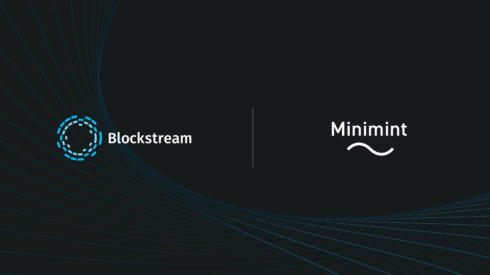

[This linked article](https://medium.com/blockstream/blockstream-sponsors-federated-e-cash-as-a-bitcoin-scaling-technology-637ba05de7b3) provides an overview of the funding provided to Eric Sirion for the development of Minimint.

This articles also has a great simplified overview of the technical steps involved in blind signatures.

:::note
Initially _Fedimint_ was meant to be an umbrella organization for the different efforts to build federated Chaumian e-cash mints. Unfortunately only one project, _MiniMint_, generated any traction and continues to be actively developed. That’s why _Fedimint_ became synonymous with _MiniMint_ over time and today the two names are a source of much confusion. A renaming of *MiniMint will involve many code changes, that’s why it hasn’t happened yet. 
:::